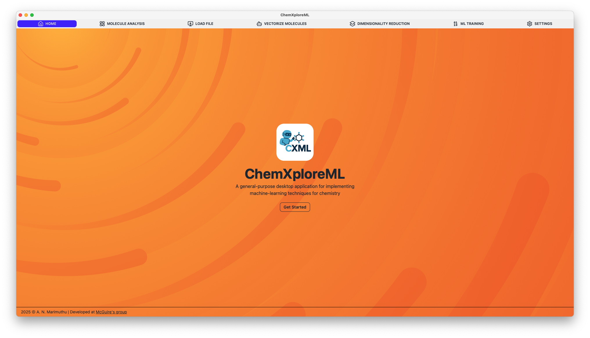

# ChemXploreML - Chemistry eXploration with Machine Learning

    

## Overview

ChemXploreML is a user-friendly desktop application specifically designed to bring the power of machine learning to chemistry research. It streamlines the entire machine learning pipeline for molecular property prediction, making sophisticated computational techniques accessible to chemists without extensive programming or machine learning expertise.

The field of machine learning in chemistry has experienced explosive growth, particularly since 2015, with over half of all AI-related chemistry papers published in the four years leading up to 2020. ChemXploreML aims to facilitate this trend by providing an intuitive platform for exploring and predicting molecular properties.

_[Marimuthu, A. N. & McGuire, B. A. Machine Learning Pipeline for Molecular Property Prediction Using ChemXploreML. J. Chem. Inf. Model. 65, 5424-5437 (2025).](https://pubs.acs.org/doi/10.1021/acs.jcim.5c00516)_

**Key Use Cases and Capabilities**

ChemXploreML is a versatile tool that supports various stages of a machine learning workflow in chemistry:

**Molecular Property Prediction:** The application is built to predict fundamental molecular properties of organic compounds, such as melting point (MP), boiling point (BP), vapor pressure (VP), critical temperature (CT), and critical pressure (CP).

**Molecular Representation (Embedding):** A core challenge in applying machine learning to chemistry is converting molecular structures into numerical representations that algorithms can understand.  ChemXploreML supports state-of-the-art molecular embedding techniques, including:

- Mol2Vec: An unsupervised method inspired by natural language processing that translates molecular fragments into fixed-length vectors (typically 300 dimensions).
  
- VICGAE (Variance-Invariance-Covariance regularized GRU Auto-Encoder): A sophisticated deep generative model that produces compact (32-dimensional) molecular embeddings, capable of capturing both global structural features and subtle chemical variations.

The modular design allows for the seamless integration of new embedding methods like ChemBERTa and MoLFormer for future benchmarking.

**Data Preprocessing and Analysis:** ChemXploreML automates crucial preprocessing steps, including:

**Data Cleaning:** It leverages cleanlab for robust outlier detection and removal, enhancing data reliability for model training.

**Chemical Space Exploration:** The application provides unified interfaces for analyzing elemental distribution, structural classification (aromatic, noncyclic, cyclic nonaromatic), and molecular size distribution.

**Dimensionality Reduction:** Includes tools like UMAP (Uniform Manifold Approximation and Projection) to visualize high-dimensional molecular embeddings in a lower-dimensional space, revealing clustering patterns that correlate with molecular properties.

**Model Training and Optimization:**

- Machine Learning Algorithms: Supports various state-of-the-art tree-based ensemble methods for regression tasks, including Gradient Boosting Regression (GBR), XGBoost, CatBoost, and LightGBM (LGBM).

- Hyperparameter Optimization: Integrates Optuna, a framework that uses efficient search algorithms like Tree-structured Parzen Estimators (TPE) to identify optimal model configurations, leading to faster convergence and better parameter combinations than traditional methods.

- Cross-Validation: Employs N-fold cross-validation (typically 5-fold) to ensure robust and reliable performance estimates across different data splits.

**Future Applications:** ChemXploreML has potential for further applications in spectroscopy, such as estimating ground vibrational energies and IR frequency shifts. Its flexible architecture allows for the seamless integration of new molecular embedding methods and machine learning algorithms, making it a valuable tool across cheminformatics, materials science, and related fields.

## Contributing

Contributions are welcome! Please read our [contributing guidelines](CONTRIBUTING.md) to get started.

## License

This project is licensed under the MIT License - see the [LICENSE](LICENSE) file for details.
